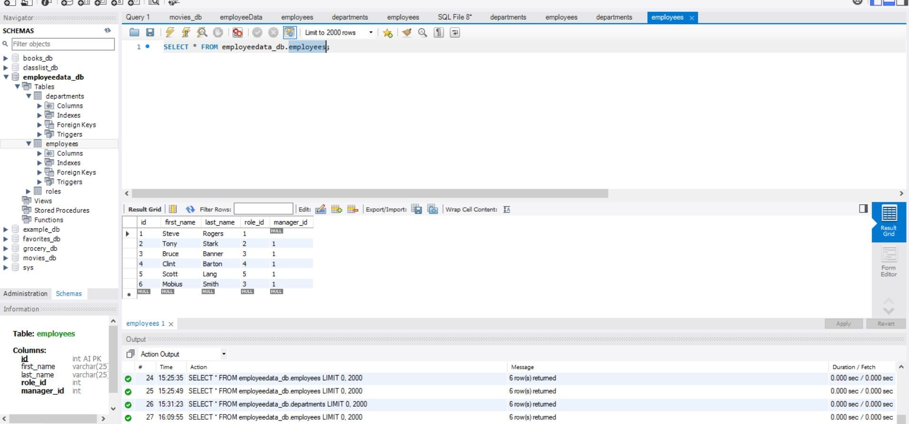
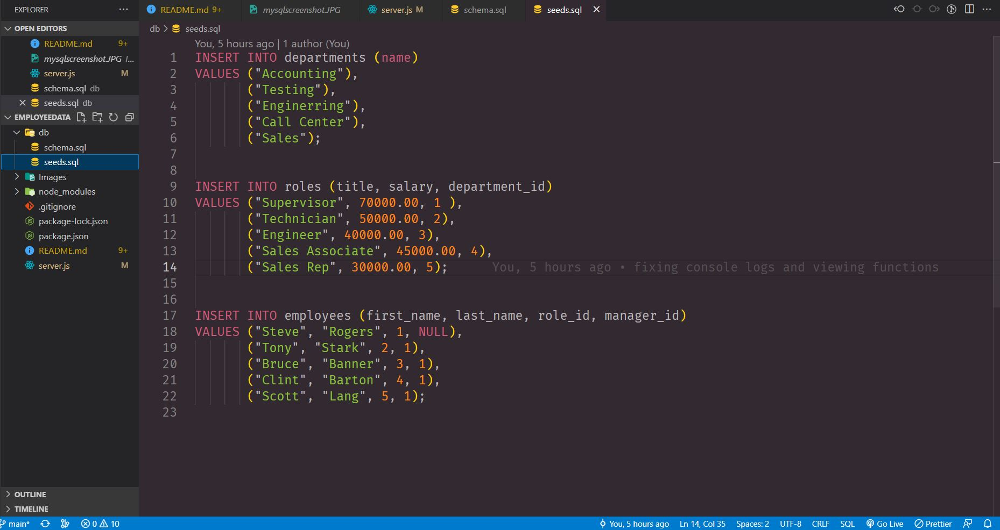
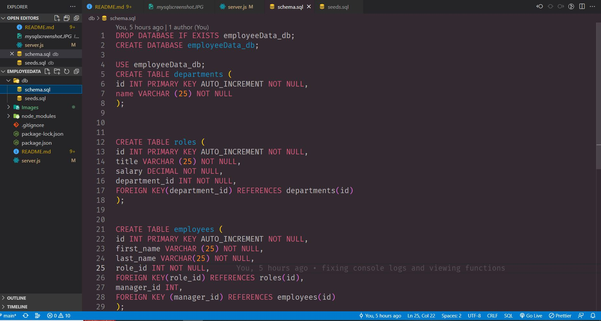

# Employee Database

## _Table Of Contents_

1. [Description](#description)
2. [Usage](#usage)
3. [Installation](#installation)
4. [License](#license)
5. [Criteria For Assignment](#criteria-for-assignment)
6. [Repo Link](#repository-link)
7. [Walkthrough Video](#walkthrough-video)
8. [Screen Shots](#screen-shots)

## Description

For this assignment I was tasked with creating an application where an employer could use to easily see their employees and roles that work there in a clean table format. The user will be able to navigate the options so they can view all roles, departments and employees. The user will also be able to add a department, role or employee to their database. When the prompts are finished being entered the user will be brought back to the options to select from so they can view their changes. This will make it easier for the company to organize and look through the data of their company.

## Usage

The user will be able to go through prompts to be able to view data pertaining to their company. The user can see all of their employees, their roles as well as the departments they have in their business. This will allow the user to organize and see what data their is that pertains to their employees. With all the employee information and departments laid out for the employer then this will make it easier to organize and expand their business.

## Installation

You will need to install node, inquirer, console.table and MySQL2 after cloning the repo

## License

MIT

_Website for license_

[MIT License Website](https://mit-license.org/)

## Criteria-for-assignment

GIVEN a command-line application that accepts user input

_WHEN I start the application_
**THEN I am presented with the following options: view all departments, view all roles, view all employees, add a department, add a role, add an employee, and update an employee role**

_WHEN I choose to view all departments_
**THEN I am presented with a formatted table showing department names and department ids**

_WHEN I choose to view all roles_
**THEN I am presented with the job title, role id, the department that role belongs to, and the salary for that role**

_WHEN I choose to view all employees_
**THEN I am presented with a formatted table showing employee data, including employee ids, first names, last names, job titles, departments, salaries, and managers that the employees report to**

_WHEN I choose to add a department_
**THEN I am prompted to enter the name of the department and that department is added to the database**

_WHEN I choose to add a role_
**THEN I am prompted to enter the name, salary, and department for the role and that role is added to the database**

_WHEN I choose to add an employee_
**THEN I am prompted to enter the employee’s first name, last name, role, and manager, and that employee is added to the database**

_WHEN I choose to update an employee role_
**THEN I am prompted to select an employee to update and their new role and this information is updated in the database**

## Repository-Link

[Github](https://github.com/PintoDrop/employeedata)

## Walkthrough-Video

[Walkthrough Video](https://drive.google.com/file/d/16slLw0o8ZHY9unKsz7d1RDPkOKQOJYFZ/view)

## Screen-Shots

